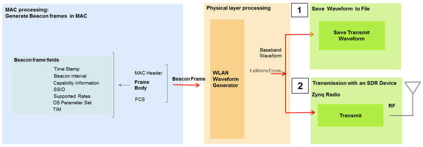
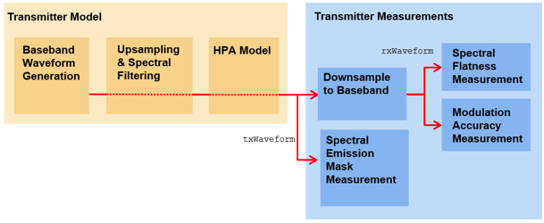

#**Task 1**

[example page](https://nl.mathworks.com/help/wlan/examples/802-11-ofdm-beacon-frame-generation.html)

---

####**Create an IEEE 802.11 beacon frame.**
The beacon frame is a type of management frame which identifies a basic service set (BSS) formed by a number of 802.11 devices. The access point of a BSS periodically transmits the beacon frame to establish and maintain the network. It consists of:
* MAC header
* beacon frame body
* FCS (frame check sequence)

To transmit the beacon over the air, the Xilinx Zynq-based radio support package is required.

The MAC frame bits for the beacon frames are generated using the helper function **helperGenerateBeaconFrame()**.

#**Task 2**
---

####**802.11ac Transmitter Modulation Accuracy and Spectral Emission Testing:**

* Waveform consists of 20 80MHz VHT packets
* The packets are separated by 10 microseconds
* Random data is used in each packet and 256QAM modulation is used
* The baseband waveform is upsampled and filtered to reduce the out of band emissions to meet the spectral mask requirement
* A high power amplifier (HPA) model is used, which introduces inband distortion and spectral regrowth
* Spectral emission mask measurement is performed
* Downsampled and the error vector magnitude (EVM) of the VHT Data field is measured to determine the modulation accuracy

* **wlanVHTConfig** function is used to define the waveform

* the waveform is then generated using the function **wlanWaveformGenerator**
  * first the number of packets and the idle time needs to be specified
  * the previous configuration variables are passed on to the function
  * random data passed onto the waveform
  * 802.11ac VHT packets

* sample rate of the waveform is found using **wlanSampleRate()**

* spectral filtering
  * out of band spectral emissions
  * spectral regrowth

* Oversampling is used to simulate the effect of the high power amplifier on the waveform and to view the out of band spectral emissions. This requires an interpolation filter (remove spectral images)

* **dsp.FIRInterpolator** creates the filter that needs to be applied to the waveform

* The power amplifier is simulated using the Rapp model with the function **comm.MemorylessNonlinearity**. The HPA is backed off to operate below the saturation point to reduce distortion.

* **dsp.FIRDecimator()** is used to resample to baseband with the same variables used for oversampling.

**Packet processing:**

* The function **wlanVHTDataRecover()** is used to demodulate, equalize and decode the VHT Data symbols
