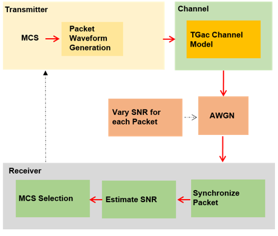

# **Transmit Rate Control Example**
---

Dynamic rate control by varying the modultation and coding scheme (MCS) of successive packets transmitted over a frequency selective multipath fading channel.

Any time a packet has to be retransmitted at the 802.11 layer (because no 802.11-layer Ack was received within the Ack window at the end of the packet transmission), the transmitting device may choose to send the retransmission at a lower (more robust) rate. So rates can change instantly from one packet to the next

A recommended MCS for transmitting a packet is calculated at the receiver and is available at the transmitter without any feedback latency. In a real system this information would be conveyed through a control frame exchange. The MCS is adjusted for each subsequent packet in response to an evolving channel condition with noise power varying over time.

---
* Waveform consisting of a single VHT format packet is generated.
* The waveform is passes through a TGac channel and noise is added.
* The packet is synchronized and decoded to recover the PSDU
* The SNR is estimated and compared against thresholds to determine which MCS is suitable for transmission of the next packet.

MCS 1 = QPSK rate-1/2

* Waveform Configuration
* Channel Configuration (TGac N-LOS channel model is used with delay profile Model-D)
* Rate Control Algorithm Parameters
  * Usually use channel quality or link performance metrics, such as SNR or packet error rate, for rate selection
  * |rcaAttack| and |rcaRelease| controls smooth rate changes to avoid changing rates prematurely. |threshold| + |rcaAttack| => increase MCS / |threshold| - |rcaRelease| => decrease MCS
* Simulation Parameters
  * channel slowly evolves thus changing the SNR measured at the receiver (simulated through |walkSNR|). Setting this to false will make channel variations the main source of SNR variations at the receiver.
* Processing Chain 
